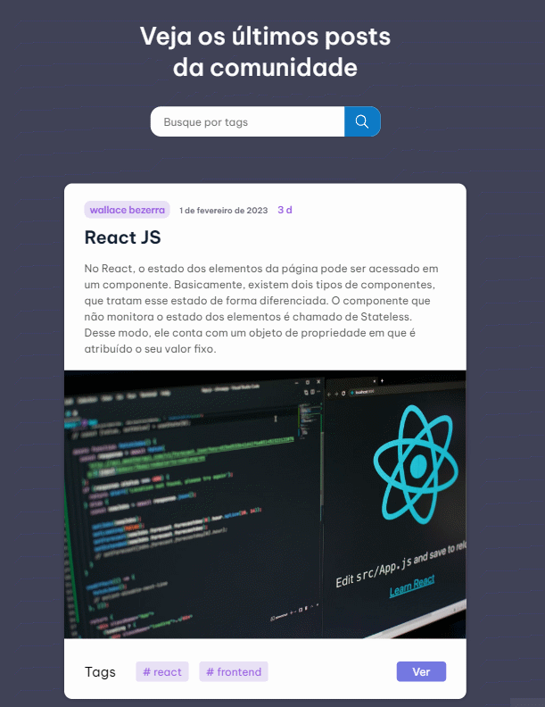
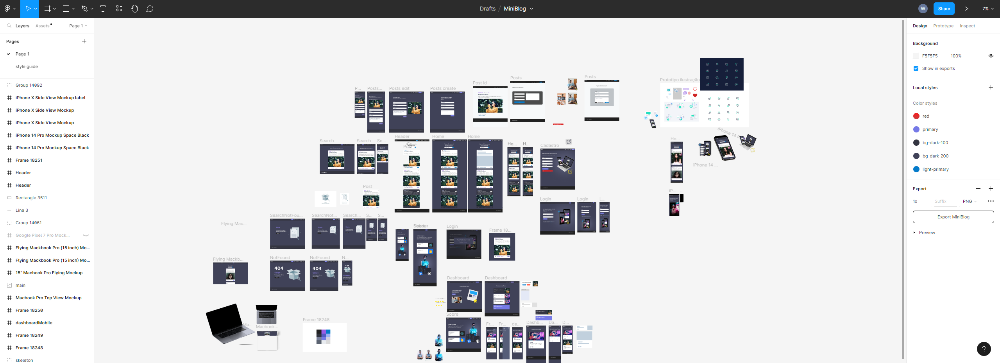

<h1 align="center"> Secret Word </h1>

## 💻 Projeto

Miniblog é um projeto feito para publicarmos posts, nele podemos criar uma conta e postar sobre qualquer assunto. 
Podendo inserir uma imagem e conteudo do assunto.

Feito com React JS e Firebase, utilizando o Framer Motion para algumas animações e React Router Dom para criação de rotas.

 

  

- Foi utilizado o Firebase para realizar o cadastro e autenticação dos usuários.

  

- Cada post tem a data e hora em que foi feita a postagem.

  

- Criei um loading Skeleton

  

## 🚀 Tecnologias

Esse projeto foi desenvolvido com as seguintes tecnologias:

- [React](https://reactjs.org/) ( Hooks, Props, States, React Router Dom, Context Api, useReducer, Custom Hooks,  )
- [Sass](https://sass-lang.com/)
- [Firebase](https://firebase.google.com/) (Login e cadastro de usuários com autenticação, CRUD dos posts)
- [Vite](https://vitejs.dev/)
- [Framer Motion](https://www.framer.com/motion/)
- [Figma](https://www.figma.com/)

## 📱 Mobile

  

## 🖥️ Figma

- Link:  https://www.figma.com/file/SlrBNZP6QGvJ9GPhcq5wsR/MiniBlog?node-id=0%3A1&t=mjCY5rvCNrY335UC-0

  

---

Feito com ♥ by Wallace Bezerra

  

